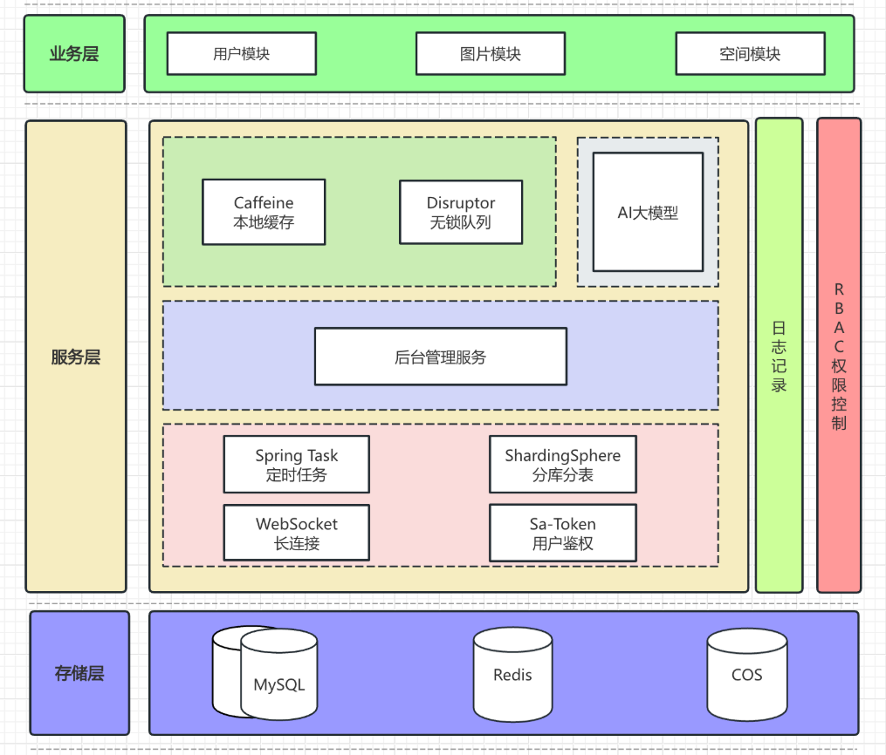

# 云枢图库

## 项目简介

**基于 Spring Boot 3.0.0 开发，使用 Mysql + Redis + WebSocket + SaToken 权限管理 + DDD 领域驱动设计架构实现的智能协同云图库。**  

**分为公共图库、私有图库、团队共享图库，接入了AI绘图大模型，可以针对原有图片进行二次创作。**  

- 个人用户：访问公共图库、团队共享图库或创建私有空间，进行资源的检索、处理、编辑和分析。  

- 企业用户：享有更多资源，可开通团队空间，与成员协同管理图库资源。  
  
所有用户都可以在公共图库中上传图片，检索自己需要的图片。图库中的图片资源都有自己的标签、分类，可以根据标签进行检索，
也可以根据**颜色相似度、以图搜图**等功能进行图片的查询。    

个人用户：可以创建自己的私有空间，并且进行批量管理、检索、编辑、删除等操作，可以用作**个人图床、
个人作品集甚至个人网盘**等等。  
  
企业用户：在个人用户的基础上，对**空间的使用量、可上传的图片总数等进行全方位的升级**，同时团队空间可以进行团队管理功能，
可以邀请成员进行资源管理，也可以对成员给予一定的操作权限。权限大致分为管理员、编辑者、浏览者。每种角色对应不同的权限，
清晰明了。还可以对邀请空间内的成员进行团队协作，**实时协同编辑图片**。  
  
管理员：**拥有对所有空间和图库的管理权限**，对整个平台进行管理，可以进行用户管理、资源管理、团队管理、系统设置等。
**可以对各个空间以及公共空间进行统计分析**，根据使用量以及资源使用情况进行分析。
针对违规用户可以进行封禁操作，违规图片或文件进行删除。

## 项目整体框架设计图：

### 采用技术栈 & 项目架构
- Spring Boot 3.0.0
- MyBatis Plus 数据访问
- Mysql 数据库
- Redis 数据库
- 分布式 Session 登录 + Jwt-Token 登录
- WebSocket + Disruptor
- SaToken 权限管理
- DDD 架构

## 项目基础通用模块
**封装了全局异常处理器、自定义错误码、统一响应类、返回工具类、日志AOP、权限校验AOP、抛异常工具类等。**
## 主要模块
- 用户模块
- 图库资源管理
- 空间模块
- 团队协作模块
- 空间分析模块

## 用户模块
用户登录：

- 采用 **Session 和 Jwt-Token** 的登录方式，两者互不影响，可以同时使用。
针对一些不携带 cookie 的用户也能实现常规功能的访问。此外两种方式都支持**分布式登录**。
- 对用户密码进行加盐加密，并使用MD5加密算法进行二次加密，保障用户的信息安全。  

管理员管理：
- 管理员可以进行用户管理，对用户进行封禁、解封、重置密码等操作。

## 图库资源管理
每个用户针对每种类型的空间仅能创建一个。

公共图库：
- 公共图库中所有用户都能访问，且都可以进行**图片检索、图片上传、图片下载、以图搜图、图片主色调搜图**等操作。
仅有图片作者可以对公共图片中的个人作品进行编辑、删除等操作。

私有图库：
- 仅有本人可以查看的私有图库，可以进行图片检索、图片上传、图片下载、以图搜图、图片主色调搜图等操作。

团队共享图库：
- 可以邀请企业人员加入团队图库，并进行权限的划分。只有拥有权限的用户才能对图库进行修改、查看、编辑等操作。
还可以邀请团队人员对图片进行协同编辑。

## 空间模块
提供多种空间类型，对应不同的空间额度限制，个人和企业用户可以根据需求选择空间类型；
该模块基于分段锁 + 编程式事务实现空间的创建，同时提供为该模块添加统计分析功能，
结合用户使用量和额度对使用习惯进行分析。管理员可以对整个平台进行空间分析，对用户进行封禁操作，对违规图片进行删除等操作。

## 团队协作模块
该模块基于 WebSocket + Disruptor 实现团队协作，对团队成员进行实时通信，当用户具有图片的编辑权限时，可以邀请该空间下，
具有权限的用户进行协同编辑。使用 WebSocket 实现客户端与服务器之间的全双工通信，确保消息的即时传递。
支持文本消息、图片更新通知、编辑操作同步等多种类型的消息推送。  
当用户加入后，**会进行广播**。
  

  

用户需要进入编辑状态才可以进行操作，该状态下仅能有一个用户进行操作，防止出现操作冲突等问题。  

  

此外，还会对会话内的用户进行消息传递。  
  

**多用户可以编辑同一张图片，避免了传统方式中的来回传递文件的繁琐过程。
因为具有消息传递的功能，所以结合前端，能实时预览功能使得团队成员可以及时交流，减少误解和错误。
所有参与者的编辑操作都是可见的，用户可以在任何时间、任何地点加入协同编辑会话，不受地理位置限制。
这也增强了团队的合作。**

## 空间分析模块
为用户和管理员都提供了空间分析功能，可以查看空间使用情况，对空间进行统计分析，合理规划空间使用额度。

## DDD 领域驱动设计
**重构前的结构目录：**  

  

**重构后的结构目录：**  

